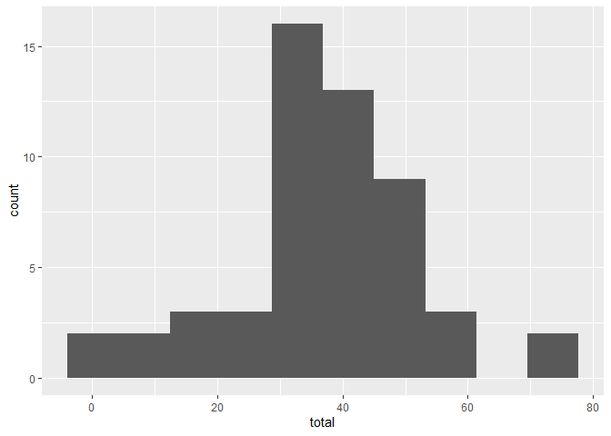
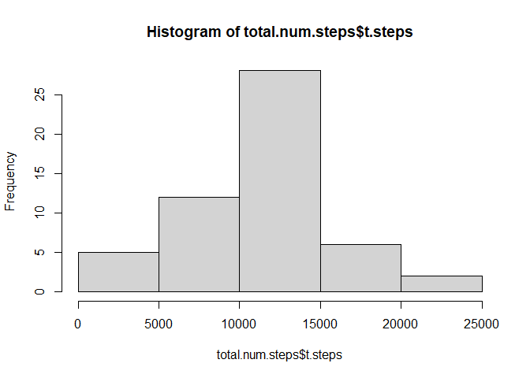
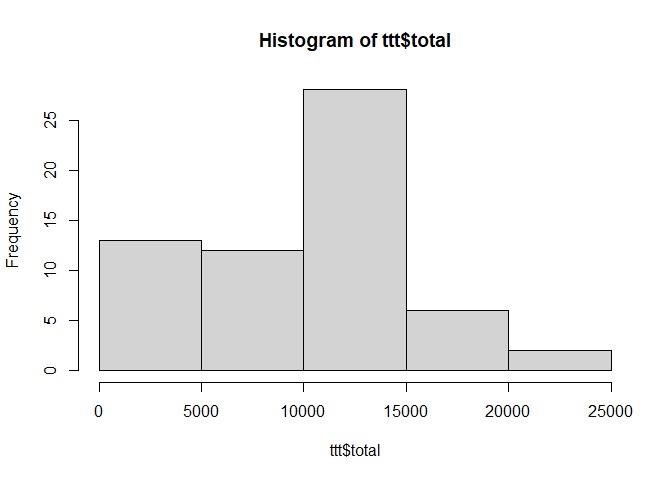
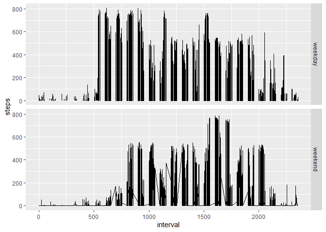

## Loading and preprocessing the data


``` r
unzip("activity.zip",exdir = "data.csv")
activity_data <- read.csv("data.csv/activity.csv")
library(dplyr)
library(ggplot2)
```

## What is mean total number of steps taken per day?


``` r
#calculating the mean number of steps per day
steps_per_day <- activity_data %>% group_by(date) %>% summarise(total = mean(steps))
#plotting the mean steps per day
ggplot(steps_per_day, aes(x = total)) + geom_histogram(bins = 10)
```

```
## Warning: Removed 8 rows containing non-finite outside the scale range
## (`stat_bin()`).
```

<!-- -->

``` r
# The mean and the median for mean values
summary(steps_per_day$total)
```

```
##    Min. 1st Qu.  Median    Mean 3rd Qu.    Max.     NAs 
##  0.1424 30.6979 37.3785 37.3826 46.1597 73.5903       8
```

``` r
#________________________________________#
# Aggregating the sum of steps per day
total.num.steps <- activity_data %>% group_by(date) %>% summarise(t.steps = sum(steps))

# plotting the total steps taking per day
hist(total.num.steps$t.steps)
```

<!-- -->

``` r
# The mean and median of total steps per day
summary(total.num.steps$t.steps)
```

```
##    Min. 1st Qu.  Median    Mean 3rd Qu.    Max.     NAs 
##      41    8841   10765   10766   13294   21194       8
```

## What is the average daily activity pattern?


``` r
## Imputing missing values
# Number of rows with missing values
bad <- is.na(activity_data)
table(bad)
```

```
## bad
## FALSE  TRUE 
## 50400  2304
```

``` r
# Getting the mean of steps per day
mean_step_day <- mean(activity_data$steps, na.rm = TRUE)

# Getting the amount of missing values and their corresponding day
ff <- activity_data %>% group_by(date) %>% summarise(missing = sum(is.na(steps)))

imputed.val <- ff %>% filter(missing == 288) %>% select(date) %>% mutate(total = 37)

# Missing vales imputed to the mean of steps per day "37"
ttt <- activity_data %>% group_by(date) %>% summarise(total = sum(steps)) %>% filter(!is.na(total)) %>% bind_rows(imputed.val)

# plotting after imputation
hist(ttt$total)
```

<!-- -->

``` r
# Mean and median after imputation
summary(ttt$total)
```

```
##    Min. 1st Qu.  Median    Mean 3rd Qu.    Max. 
##      37    6778   10395    9359   12811   21194
```

``` r
## Are there differences in activity patterns between weekdays and weekends?
activity_days <- activity_data %>% mutate(weekday = weekdays(as.POSIXct(date))) %>% group_by(weekday) %>% mutate(
    weekend.day = case_when(
       weekday == "Tuesday"~ "weekday",
       weekday == "Wednesday"~ "weekday",
       weekday =="Thursday"~ "weekday",
       weekday =="Friday"~ "weekday",
       weekday =="Monday" ~ "weekday",
       weekday =="Saturday" ~ "weekend",
       weekday =="Sunday" ~ "weekend"
    ))

ggplot(data =activity_days, aes(x = interval, y = steps)) + facet_grid(rows = "weekend.day") + geom_line()
```

```
## Warning: Removed 2 rows containing missing values or values outside the scale range
## (`geom_line()`).
```

<!-- -->
